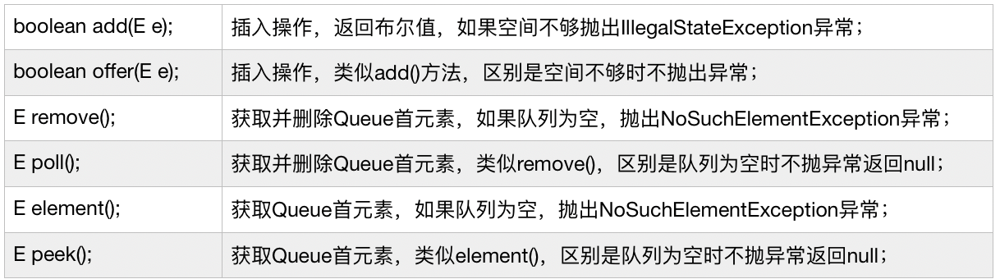
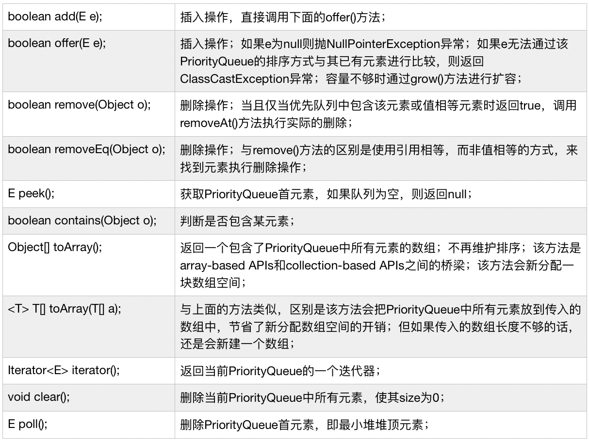

学习笔记

1. Queue 源码分析
    * 在Java中，Queue是一个Interface，继承了Collection接口；
    * Queue包含了许多实现类，包括了LinkedList、PriorityQueue、ArrayDeque等；
    * 包含的操作有：

        

2. PriorityQueue源码分析
    * 在Java中，PriorityQueue是一个Class，继承了AbstractQueue抽象类，间接实现Queue接口；
    * 利用平衡二叉堆（Balanced Binary Heap）实现，以Object[] queue数组存放元素，queue[n]的两个子节点分别为queue[2*n+1]和queue[2*n+2]；
    * 默认的初始容量为11；
    * 通过comparator来排序，如果comparator为null，则使用元素的自然序；
    * 默认小顶堆，即最小优先队列；
    * 7个构造函数：前4个对应不同的初始容量和排序方式的入参组合；后3个对应通过传入一个PriorityQueue或SortedSet或者其他Collection的方式来初始化一个PriorityQueue；
    * 主要操作有：

        

 