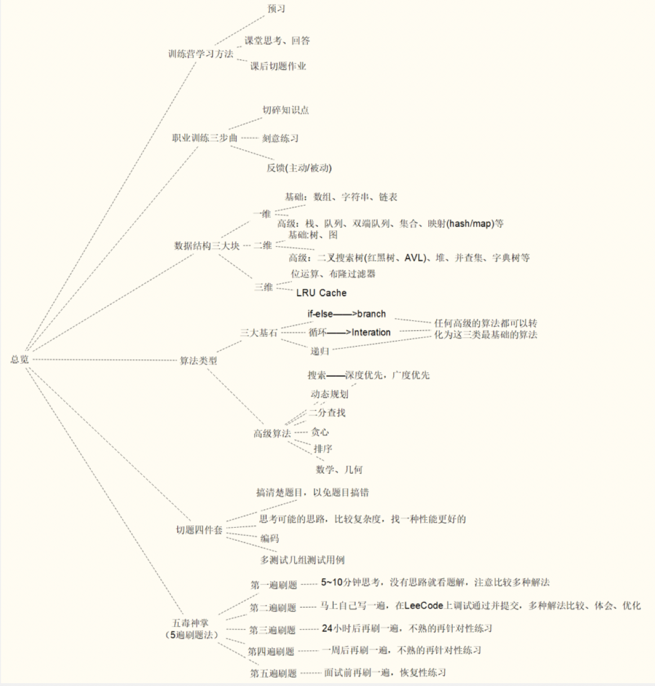

学习总结

#### 参加训练营感受

今年3月份就要参加工作5年了，回顾这5年的成长，由于职位的局限性以及个人的不求上进，技术上进益颇微，被公司的同期生远远抛在身后。最近打起精神想要换份工作，于是又捡起了算法与数据结构，为了督促自己，报名参加了训练营。

训练营课程的讲解条理很清晰，将我之前脑海中混成一团的各个概念一一捋清；同时传授给我有效的“五毒神掌”刷题法，让我意识到了抠不出来去看题解并不是一件可耻的事，而掌握优秀题解的思路和方法并化为己用才是更高效的做法。

我在算法学习群和刷题狂魔群里的参与度不高，只是能跟着做到每日一题的打卡，但是同学们的聊天记录我都在看。一方面羡慕还在大学里的同学们拥有大量的精力时间和对未来生活的选择权，另一方面被一些同学强烈的求知欲和自律勤奋所深深感染。训练营结束总共刷了80多道题，与一些优秀同学的刷题量相去甚远，但是自己的收获还是挺大的，只是希望之后能坚持下去。2021年的自己，请加油！

#### 预习课上盗来盗图，觉得总结得不错

